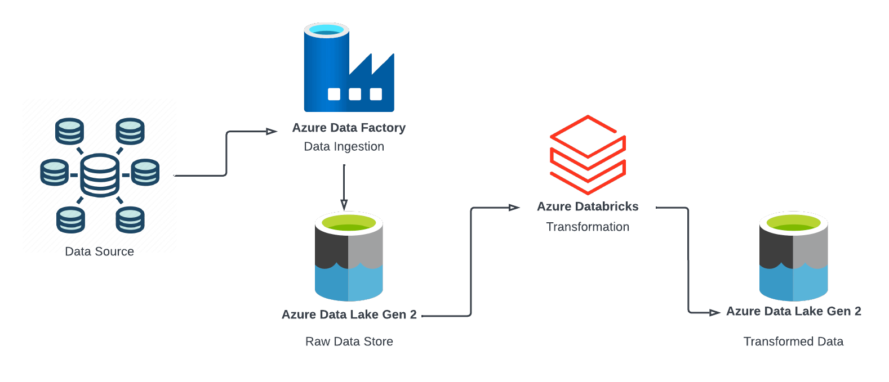

## Introduction
This project aimed to eplore fundamental concepts in data engineering and getting familiar with Azure services. 
Leveraging basic data processing techniques and common tools, the primary objectives of this project are to ingest, clean, merge, and derive insights from raw traffic data.

## Architecture

## Technology Used
- Programming Language - Python
- Azure Data Factory, Databricks,Data Lake Gen 2

## Dataset 
Traffic Flow data in Ho Chi Minh City, Viet Nam

Link: https://www.kaggle.com/datasets/thanhnguyen2612/traffic-flow-data-in-ho-chi-minh-city-viet-nam
